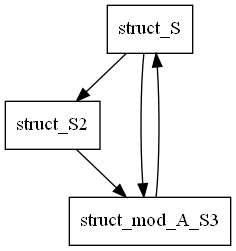

# src-graph
Cargo subcommand which shows user-defined data type dependencies.

If you found a bug, please open an issue.


# Requirement
- Cargo
- Graphviz (for generating an image)

# Install
From crates.io
```
$ cargo install src-graph
```

From source code
```
$ git clone https://github.com/tamaroning/src-graph.git
$ cd src-graph
$ cagro install --path .
```

# Usage
Run in your rust project
```
$ cargo src-graph
```

then generate an image from the dot file
```
$ dot -Tpng -o ./.src_graph/adt_deps.png ./.src_graph/adt_deps.dot
```

# Example
The code below
```rust
use std::collections::HashMap;

struct S<T> {
    a: Vec<T>,
    b: HashMap<T, S2>,
    c: mod_A::S3,
}

struct S2 {
    a: mod_A::S3,
}

mod mod_A {
    pub struct S3 {
        a: Box<crate::S<()>>,
    }
}
```

generates this graph:

