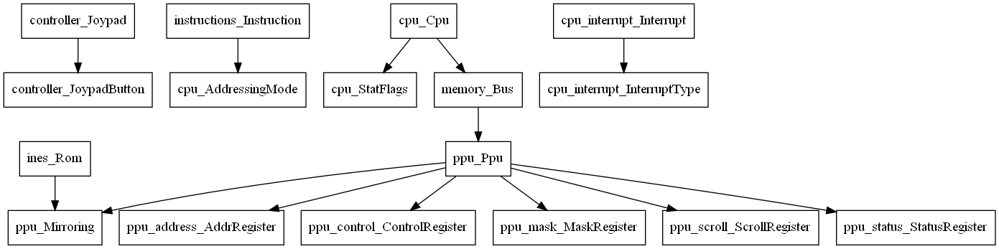

# src-graph
Cargo subcommand which shows user-defined data type dependencies.

(supports struct, enum, and union for now) 

If you found a bug, please open an issue.



# Requirement
- Cargo
- Graphviz (for generating an image)

# Install
From crates.io
```
$ cargo install src-graph
```

From source code
```
$ git clone https://github.com/tamaroning/src-graph.git
$ cd src-graph
$ cagro install --path .
```

# Usage
Run in your rust project
```
$ cargo src-graph
```

then generate an image from the dot file
```
$ dot -Tpng -o ./.src_graph/struct_deps.png ./.src_graph/struct_deps.dot
```
